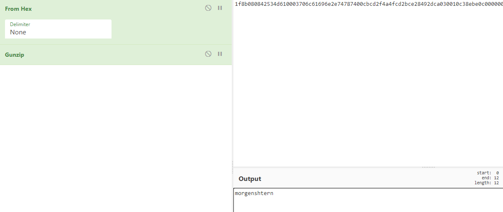

# Шифровальщик наносит ответный удар - 40
_В прошлый раз нам удалось спасти сотрудников от безделья и восстановить таки мануал! В этот раз злоумышленники "зашифровали" наш файл с важным кодом-паролем. Они издеваются, поэтому снова выложили код своего якобы шифратора, а также файл в формате hex-строки. Восстанови перемешанный hex, сделай из него файл и достань таки код-пароль! Наша фирма не хочет платить кучу денег таким мелким воришкам!_

_11a06ca9064be482cd8b58202e6e3cc00027fb9d1c307026000e03877cc0fcf4840081d32e64000440db_

[cipher.py](cipher.py)
### Solution
Обращаем своё внимание в cipher.py на строку
`data = data[:j-prev] + data[j:] + data[j-prev:j]`

Мы можем сделать вывод о том, что длина изначальной строки совпадает с данной в условии и что длина меняющихся блоков не зависит от первоначальной строки.

Напишем скрипт, чтобы узнать, какой длины блоки менялись, затем в обратном порядке поменяем их и получим исходные данные.

Скрипт:
```python
data = "a" * 84
steps = [3,11,2,13,6,4,9,5,10,8,25,11,7,3,19,4,18,40,23]
data = list(data)

d = []

prev = 0
for i in steps:
    for j in range(len(data)):
        if j % i == 0 and j - prev >= 0:
            data = data[:j-prev] + data[j:] + data[j-prev:j]
            d.append((j-prev, len(data) - j, prev))
    prev = i

data = "11a06ca9064be482cd8b58202e6e3cc00027fb9d1c307026000e03877cc0fcf4840081d32e64000440db"
indexes = d[::-1]
for index in indexes:
    data = data[:index[0]] + data[index[0] + index[1]:] + data[index[0]: index[0] + index[1]]
print(data)
```
На выходе получаем `1f8b080842534d610003706c61696e2e74787400cbcd2f4a4fcd2bce28492dca030010c38ebe0c000000`

Кидаем полученную строку в cyberchief и получаем флаг:

Флаг: `morgenshtern`